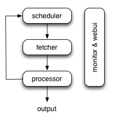

### 建筑
本文档描述了我制作pyspider和架构的原因。

#### 为什么
两年前，我正在研究垂直搜索引擎。我们正面临以下爬行需求：

收集100-200个网站，他们可以随时/离线或随时更改他们的模板

我们需要一个非常强大的监视器来找出哪个网站正在发生变化。这是一个很好的工具，可以帮助我们为每个网站编写脚本/模板。

网站更新后，应在5分钟内收集数据

我们经常通过检查索引页来解决这个问题，并使用“上次更新时间”或“上次回复时间”之类的内容来确定更改了哪个页面。除此之外，我们会在X天后重新检查页面以防止遗漏。
随着WWW一直在变化，pyspider永远不会停止

此外，我们有合作伙伴的API，API可能需要POST，代理，请求签名等。脚本的完全控制比组件的一些全局参数更方便。

#### 概观
下图显示了pyspider体系结构及其组件的概述以及系统内部发生的数据流的概述。

组件通过消息队列连接。每个组件（包括消息队列）都在自己的进程/线程中运行，并且可以替换。这意味着，当进程缓慢时，您可以拥有许多处理器实例并充分利用多个CPU，或部署到多台计算机。这种架构使得pyspider非常快。基准测试。

#### 组件
###### 调度
调度程序从处理器的newtask_queue接收任务。确定任务是新任务还是需要重新爬网。根据优先级对任务进行排序，并将其提供给具有流量控制的提取器（令牌桶算法）。处理定期任务，丢失任务和失败的任务，然后重试。

以上所有都可以通过self.crawl API设置。

请注意，在调度程序的当前实现中，只允许一个调度程序。

###### 提取程序
Fetcher负责获取网页，然后将结果发送给处理器。对于灵活的，fetcher支持数据URI和由JavaScript呈现的页面（通过phantomjs）。可以通过API通过脚本控制获取方法，标头，cookie，代理，etag等。

###### Phantomjs Fetcher
Phantomjs Fetcher就像代理一样工作。它连接到一般的Fetcher，在启用JavaScript的情况下获取和渲染页面，将一般HTML输出回Fetcher：

    scheduler -> fetcher -> processor
                    |
                phantomjs
                    |
                 internet
###### 处理器
处理器负责运行用户编写的脚本来解析和提取信息。您的脚本在无限制的环境中运行。虽然我们有各种工具（如PyQuery）可供您提取信息和链接，但您可以使用任何想要处理响应的内容。您可以参考脚本环境和API参考以获取有关脚本的更多信息。

处理器将捕获异常和日志，发送状态（任务跟踪）和新任务scheduler，将结果发送到Result Worker。

###### 结果工人（可选）
结果工作者从中接收结果Processor。Pyspider有一个内置的结果工作器来保存结果resultdb。覆盖它以根据您的需求处理结果。

###### WebUI中
WebUI是一切的Web前端。它包含：

* 脚本编辑器，调试器
* 专案经理
* 任务监控
* 结果查看器，导出器

也许webui是pyspider最吸引人的部分。使用这个功能强大的UI，您可以像pyspider一样逐步调试脚本。启动或停止项目。查找哪个项目出错以及哪个请求失败，然后使用调试器再次尝试。

#### 数据流
pyspider中的数据流如上图所示：

1. on_start当您按下RunWebUI上的按钮时，每个脚本都有一个名为callback的回调。将新任务on_start作为项目条目提交给Scheduler。
1. Scheduler将此on_start任务调度为数据URI作为Fetcher的常规任务。
1. Fetcher发出请求并对其做出响应（对于数据URI，这是一个虚假的请求和响应，但与其他正常任务没有区别），然后提供给处理器。
1. 处理器调用该on_start方法并生成一些新的URL以进行爬网。处理器向Scheduler发送一条消息，告知此任务已完成，新任务通过消息队列发送到Scheduler（on_start在大多数情况下，这里没有结果。如果有结果，则处理器将它们发送给result_queue）。
1. 调度程序接收新任务，在数据库中查找，确定任务是新的还是需要重新爬网，如果是，则将它们放入任务队列。按顺序发送任务。
1. 这个过程重复（从第3步开始）并且在WWW死亡之前不会停止;-)。调度程序将检查定期任务以爬网最新数据。