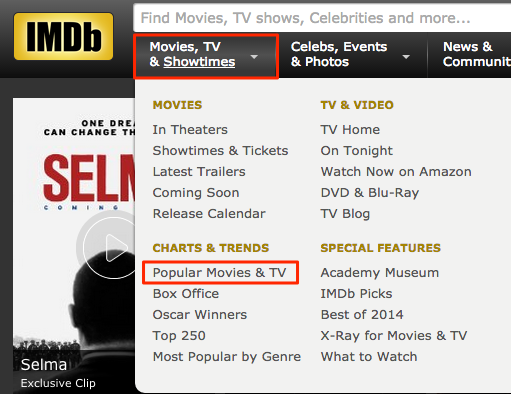
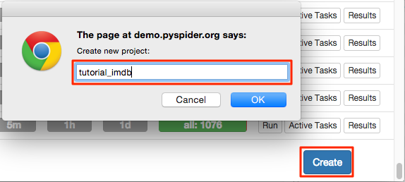
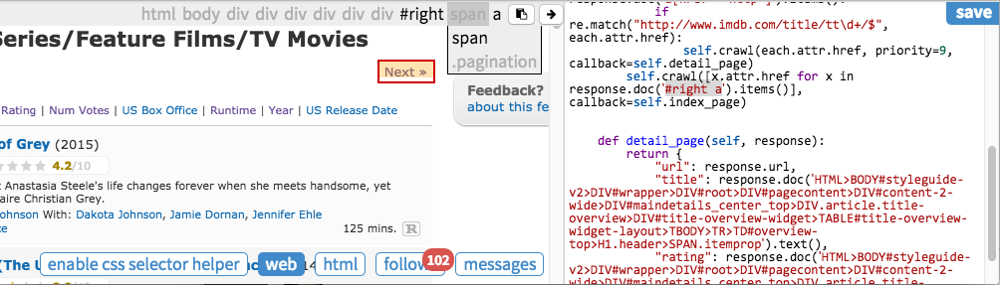
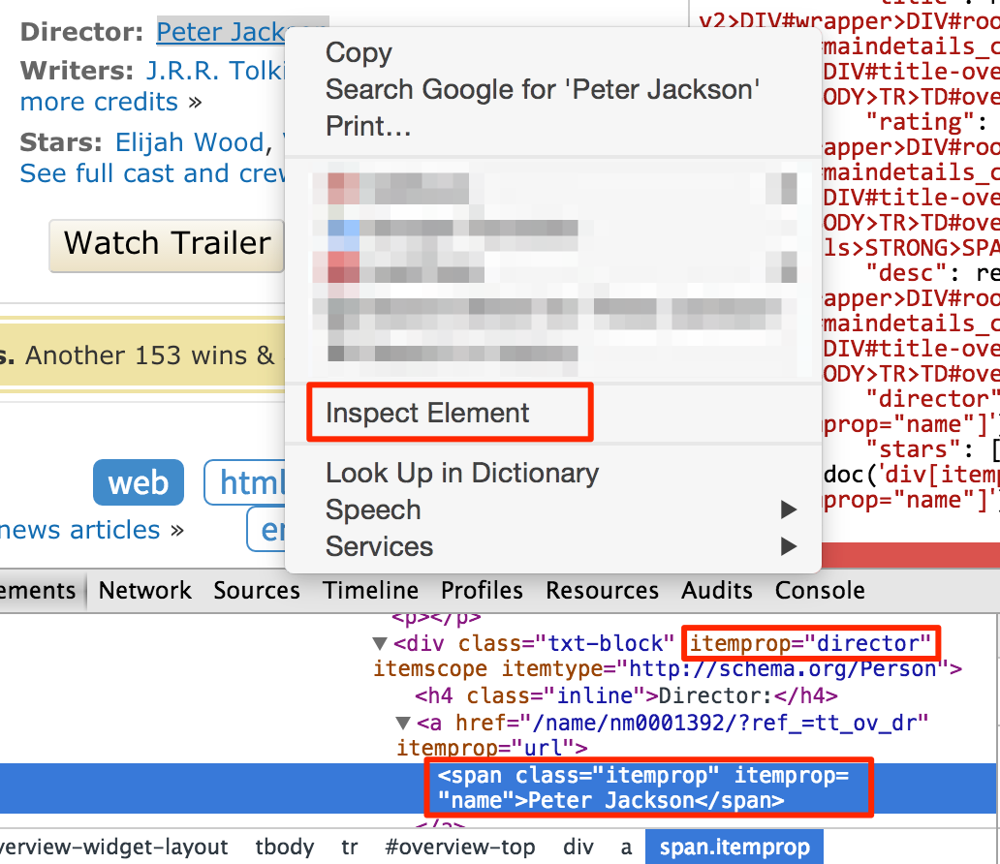
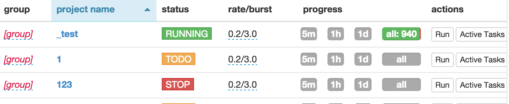

## Level 1: HTML and CSS Selector
在这个教程，我们将会从IMDb上采集电影和电视信息

一个在线的完整模型代码在：
[http://demo.pyspider.org/debug/tutorial_imdb .](http://demo.pyspider.org/debug/tutorial_imdb)

#### 开始之前
你应该安装了pyspider。你可以参考快速入门文档，或者在[demo.pyspider.org.](http://demo.pyspider.org/)测试你的代码。
在采集之前，一些基础的知识你应该知道的。

* 万维网是一个由超文本网页组成的系统
* 页面是通过统一资源符URL在万维网上定位的
* 页面是通过超文本传输协议HTTP传输协议传输的
* 网页的构成是使用超文本标记语言HTML的

采集网页信息就是：
1. 找到所有包含我们想要的信息的网页url
2. 取得网页通过HTTP协议
3. 解析网页的信息
4. 找到更多的url我们想要的，再一次执行第2个步骤

#### 选择一个开始的URL
我们想要获得IMDb的电影，第一件事就是找到一个列表。一个好的列表可能如下:

* 尽可能包含多的电影信息链接
* 通过下一页，你可以来回获得所有的电影
* 按更新时间排序的列表可以获得最新的电影

通过查看IMDb主页，我发现了这个列表：

[http://www.imdb.com/search/title?count=100&title_type=feature,tv_series,tv_movie&ref_=nv_ch_mm_1](http://www.imdb.com/search/title?count=100&title_type=feature,tv_series,tv_movie&ref_=nv_ch_mm_1)

#### 建立一个项目
你可以找到“Create”按钮在主控制台。点击并且命名。

修改抓取`crawl`的url在`on_start`回调中：

    @every(minutes=24 * 60)
    def on_start(self):
        self.crawl('http://www.imdb.com/search/title?count=100&title_type=feature,tv_series,tv_movie&ref_=nv_ch_mm_1', callback=self.index_page)
* `self.crawl`会取得页面然后调用`callback`方法去解析响应。
* `@every`装饰器表示，`on_start`将会每天运行 ，去确保不会错过任何新的电影。

点击绿色的run按钮，你就会有一个红点在紧跟，点击紧跟的仪表盘，点击绿色的继续按钮：

#### 索引页
在索引页，我们需要摘取两条信息：

* 链接到电影的链接像是`http://www.imdb.com/title/tt0167260/`
* 链接到下一页

#### 找到电影
正如你所看到的，样本处理程序已经找到1900+条连接在页面上。一个提取电影页面的方式是使用正则表达式：

    import re
    ...
    def index_page(self, response):
        for each in response.doc('a[href^="http"]').items():
            if re.match("http://www.imdb.com/title/tt\d+/$", each.attr.href):
                self.crawl(each.attr.href, callback=self.detail_page)
* `callback` 是 `self.detail_page` 在这里使用别的回调方法来解析。       
谨记，你可以使用强大的python或者你所熟悉的功能来解析信息。但是，使用CSS选择器是推荐的。

#### 下一页
CSS 选择器

CSS 选择器是一种被`CSS`用来选择需要改变样式`HTML`元素的模式。在文档中，包含信息的元素可能有不同样式，用CSS选择器去选择我想要的元素是合适的。更多的选择器信息你可以在一下当中找到：

* [http://www.w3schools.com/css/css_selectors.asp](http://www.w3schools.com/css/css_selectors.asp)
* [http://www.w3schools.com/cssref/css_selectors.asp](http://www.w3schools.com/cssref/css_selectors.asp)

你可以使用`reqponse.doc`创建的CSS选择器，它来自`PyQuery`，你可以找到更完全的资料。

#### CSS 选择器助手
pyspider 提供了一个工具叫做CSS选择器助手，它可以简化生成一个选择路径通过你点击元素。启用CSS选择器通过点击按钮在web仪表盘上。

元素会高亮，当你的鼠标在元素上面的时候。当你点击它，一个CSS路径就会展示在工具栏上。你可以编辑它还有添加到你的源代码。

点击下一步"Next》"在页面上然后添加选择的路径到你的代码上：

    def index_page(self, response):
            for each in response.doc('a[href^="http"]').items():
                if re.match("http://www.imdb.com/title/tt\d+/$", each.attr.href):
                    self.crawl(each.attr.href, callback=self.detail_page)
            self.crawl(response.doc('#right a').attr.href, callback=self.index_page)
再一次点击 run同时移动到下一页，我们可以看到"《Prev"  "Next》"有相同的选择路径。当我们使用上述代码的时候，会使用“Prev”而不是“Next”。一个解决方法是都选择他们。

    self.crawl([x.attr.href for x in response.doc('#right a').items()], callback=self.index_page)
    
#### 解析信息
再次点击run然后跳到详情页
添加你需要获取的结果到字典中，使用CSS选择器助手重复的获取值：

    def detail_page(self, response):
            return {
                "url": response.url,
                "title": response.doc('.header > [itemprop="name"]').text(),
                "rating": response.doc('.star-box-giga-star').text(),
                "director": [x.text() for x in response.doc('[itemprop="director"] span').items()],
            }
注意，CSS选择器助手可能不总是工作。你可以手写选择器路径使用Chrome的开发工具。

你不需要写过多的父级元素在选择器路径上。只需要能够区分元素就可以了。可是这个是需要经验在采集和web开发中，去知道哪一个元素是更重要的，可以用来做定位器。你可以尝试测试CSS选择器在JavaScript的控制台中使用$$比如`$$('[itemprop="director"] span')`

#### 运行
1. 在你调试好代码后，不要忘记保存它。
2. 返回主仪表盘找到你的项目
3. 改一下状态`status`从`DEBUG`到`RUNNING`
4. 按下run按钮

#### 注意
这个只是简单的例子，你会发现更多的问题当你爬取IMDb的时候。

* 列表页的引用url是为了跟踪我们，最好移除它。
* 对任何查询，IMDb不会服务超过100000个结果，你需要找到更少结果的列表页。比如[这个](http://www.imdb.com/search/title?genres=action&title_type=feature&sort=moviemeter,asc)
* 你可能需要一个列表使用最新的时间排序，然后以更短的时间更新它。
* 有一些元素是很难解析的，你可能需要通过xpath去解析它，或者python代码。