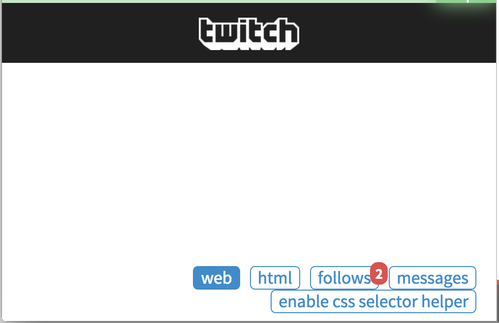
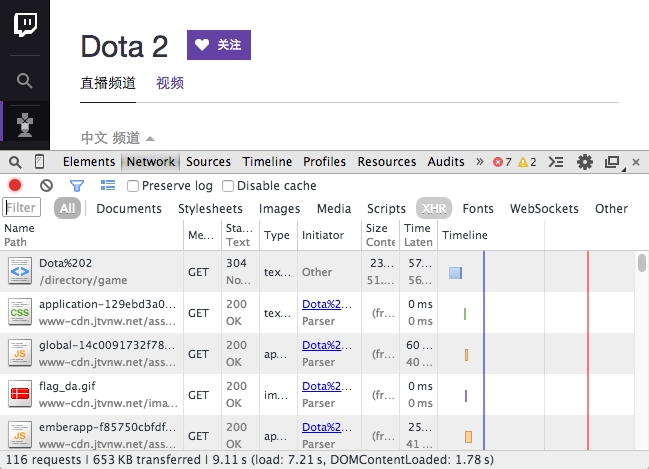
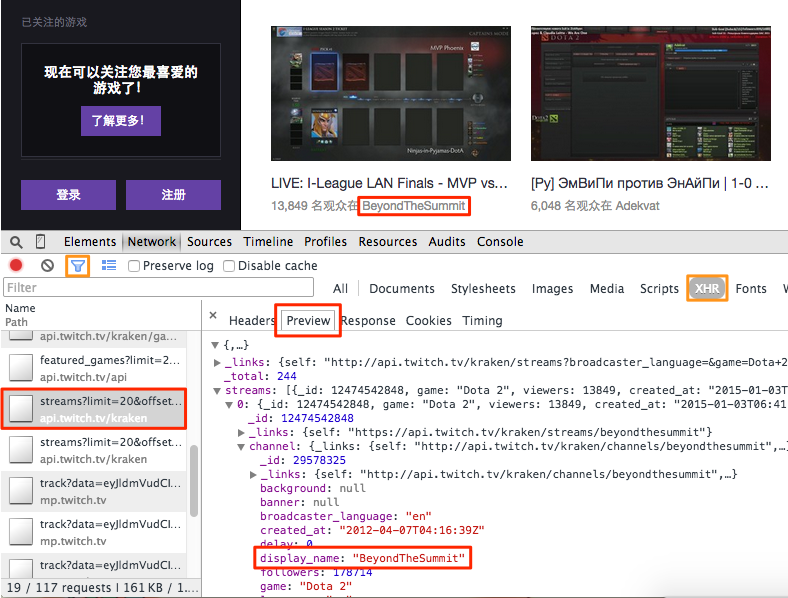
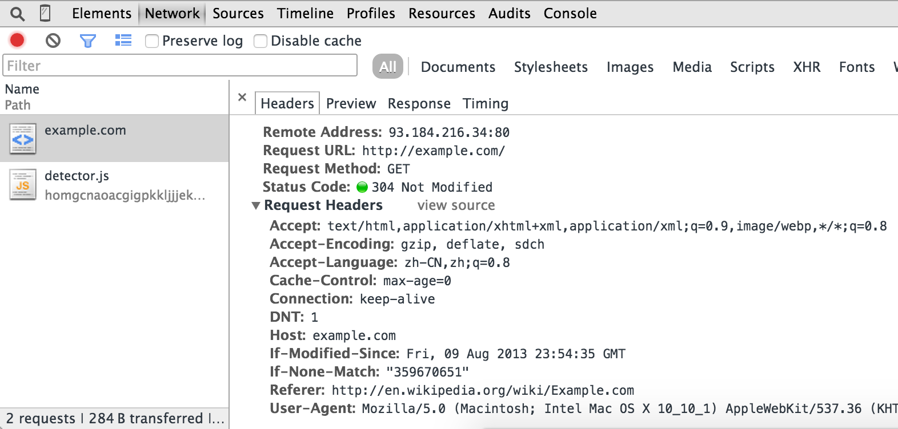

### 二年级：AJAX和更多的HTTP
在上一章节，我们讨论了怎么去解析连接和信息从HTML文档中。可是，网站内容越来越复杂通过使用某些技术，比如说：AJAX。你可能发现网页看起来不一样，当它在浏览器的时候。你想要的信息没有在HTML网页当中。

在这篇文章中，我们不会写过于复杂的爬虫脚本，但是，某些网页的片段使用了AJAX技术，或者需要URL之外更多的HTTP参数，

### AJAX
AJAX是异步JavaScript和XML的缩写。AJAX是使用现有的标准去更新网页的一部分。AJAX的一个常见用法是加载JSON数据并在客户端呈现为HTML。

您可能会现pyspider或wget提取的HTML中缺少元素。当您在浏览器中打开它时，在页面加载（可能不是）“加载”动画或单词之后会出现一些元素。例如，我们想从http://www.twitch.tv/directory/game/Dota%202中删除Dota 2的所有频道

但是你可能在页面中找不到任何内容。
### 查找请求
由于AJAX数据是通过HTTP传输的，因此我们可以在Chrome开发者工具的帮助下找到真实的请求。

打开一个新标签。  
使用Ctrl+ Shift+ I（或Mac上的Cmd+ Opt+ I）打开DevTools。  
切换到“网络”面板。  
在此选项卡中打开URL [http://www.twitch.tv/directory/game/Dota%202](http://www.twitch.tv/directory/game/Dota%202)。  
在加载资源时，您可以找到所请求资源的表。


AJAX使用XMLHttpRequest对象来发送和检索通常缩写为“XHR”的数据。使用过滤器（漏斗图标）过滤掉XHR请求。使用预览浏览每个请求：



要确定哪一个是密钥请求，您可以使用过滤器来减少请求数，通过此路径和参数猜测请求的使用情况，然后查看响应内容以进行确认。在这里我们找到了请求：http：//api.twitch.tv/kraken/streams？limit = 20＆offset = 0 &game = Dota +2 &roadcaster_language =＆on_site = 1

现在，在新选项卡中打开URL，您将看到包含频道列表的JSON数据。您可以使用扩展JSONView（对于Firfox）来获得JSON的漂亮打印视图。示例代码正在尝试提取每个频道的名称，当前标题和查看者。

```angular2html
class Handler(BaseHandler):
    @every(minutes=10)
    def on_start(self):
        self.crawl('http://api.twitch.tv/kraken/streams?limit=20&offset=0&game=Dota+2&broadcaster_language=&on_site=1', callback=self.index_page)

    @config(age=10*60)
    def index_page(self, response):
        return [{
                "name": x['channel']['display_name'],
                "viewers": x['viewers'],
                "status": x['channel'].get('status'),
             } for x in response.json['streams']]
```

* 您可以使用response.json将内容转换为python dict对象。
* 由于频道列表经常变化，我们每10分钟更新一次并用于@config(age=10*60)设置年龄。否则，它将被忽略，因为调度程序认为它足够新并且拒绝更新内容。

这是一个关于抽搐的在线演示以及使用PhantomJS的一项措施，将在下一级讨论：http：//demo.pyspider.org/debug/tutorial_twitch
#### HTTP
HTTP是交换或传输超文本的协议。我们在上一篇文章中使用过它，我们使用self.crawl了一个URL来获取由HTTP传输的HTML内容。

当您有403 Forbidden或需要登录时。您需要HTTP请求的正确参数。

http://example.com/的典型HTTP请求消息如下所示：

```
    GET / HTTP/1.1
    Host: example.com
    Connection: keep-alive
    Cache-Control: max-age=0
    Accept: text/html,application/xhtml+xml,application/xml;q=0.9,image/webp,*/*;q=0.8
    User-Agent: Mozilla/5.0 (Macintosh; Intel Mac OS X 10_10_1) AppleWebKit/537.36 (KHTML, like Gecko) Chrome/40.0.2214.45 Safari/537.36
    Referer: http://en.wikipedia.org/wiki/Example.com
    Accept-Encoding: gzip, deflate, sdch
    Accept-Language: zh-CN,zh;q=0.8
    If-None-Match: "359670651"
    If-Modified-Since: Fri, 09 Aug 2013 23:54:35 GMT
```
    
   
* 第一行包含HTTP方法，路径和HTTP版本
* key: value格式的几行请求标题字段。 
* 如果有消息体（比如POST请求），则空行和消息体将附加到请求消息的末尾。

您可以使用我们在上一节中使用的Chrome开发者工具 - 网络面板获取此信息：


在大多数情况下，您需要的最后一件事是从网络面板复制正确的URL +方法+标题+正文。
##### cURL命令

self.crawl支持cURL命令作为发出HTTP请求的参数。它将解析命令中的参数并将其用作fetch参数。

通过Copy as cURL请求，您可以获得cURL命令并粘贴以self.crawl(command)轻松进行爬网。

#### HTTP方法
HTTP定义了指示要对所标识的资源执行的期望动作的方法。两种常用的方法是：GET和POST。GET是当您打开URL时，请求指定资源的内容。POST用于向服务器提交数据。

TODO：需要这里的例子。

#### HTTP标头
HTTP标头是请求的参数列表。在抓取时需要注意的一些标题：

#### 用户代理
一个用户代理字符串告诉服务器的应用程序类型，操作系统或软件版本谁发送HTTP请求。

pyspider的默认用户代理字符串是： pyspider/VERSION (+http://pyspider.org/)

#### 引荐
Referer是上一个网页的地址，从该网页上跟随了当前请求页面的链接。某些网站在图像资源中使用此功能来防止深层链接。

TODO：需要这里的例子。

#### HTTP Cookie
HTTP Cookie是HTTP标头中的一个字段，用于跟踪哪个用户发出请求。通常用于用户登录并防止未经授权的请求。

您可以使用self.crawl(cookies={"key": value})像API这样的dict来设置cookie。

TODO：需要这里的例子。